# DBS302 – Practical 3

## Theory overview

### MongoDB Data Modeling for E‑Commerce
- Data modeling in MongoDB is organization of data within a database and the links between the related entities. 

- The principle behind the data modeling in mongodb is that if we want to access the data together then we should keep it together. 

**Created Database on ecommerce and Collection.**

### Insert Sample Data

**Two user document was inserted in the ecommerce database**

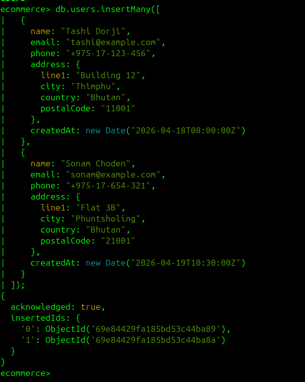

**To confirm the two users are inserted I used the **FIND** method for more flexible queries using the collection name **users****

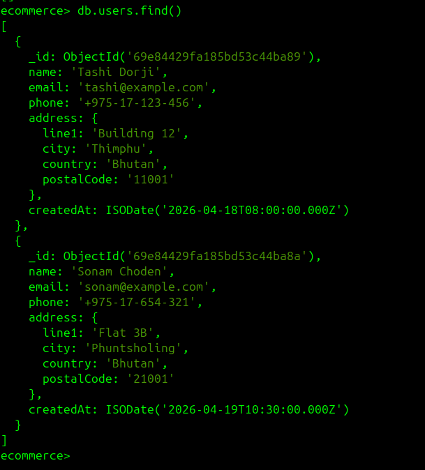

**Two categories were created were the electronics is the parent and accessories is the child to store document by referencing to parent nodes to children nodes. Here the parent document stroes with parentCategoryID:null that dont have the children reference but children stores data with the parentCategoryID:electronics that points back to the parent using parentID.**

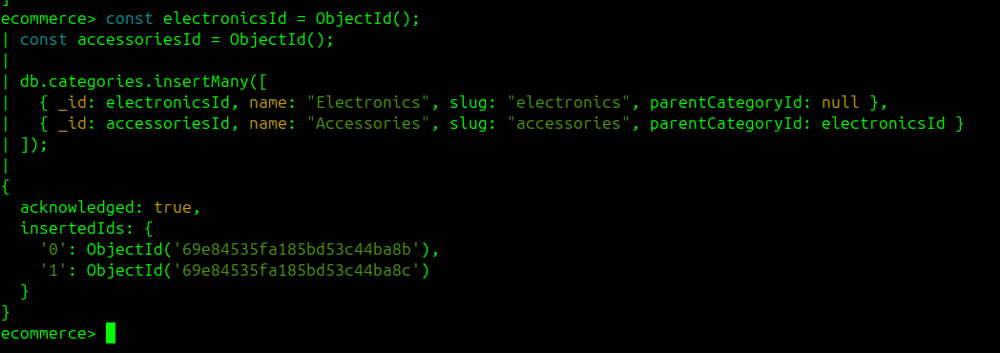

**It confirms that the child node reference the parentCategoryId demonstrating a self referenceing relationship using the referencing pattern for hierarchical data.**

**It confirms that the parentCategoryId field references the parent category, demonstrating a self-referencing relationship using the referencing pattern for hierarchical data.**

**Three products was inserted to demonstrate the Attribute Pattern, where variable product fields are stored in a flexible attributes map rather than fixed columns.**

**It confirms that the product has a different set of attributes keys. This flexibility is a key advantage of MongoDB's document model over rigid relational schemas.**

**Here the orders were inserted with embedded order items and with the Key product details such as productName and unitPrice were duplicated into each item to preserve historical accuracy.**

It Confirms the following :
- Order items are embedded because they are tightly coupled with their parent order and are always read together.
- productId is still retained as a reference to allow $lookup joins when full product details are needed.
- Duplicating productName and unitPrice ensures order history remains accurate even if a product is later updated or deleted.

## Aggregation Framework: Core Analytics Queries

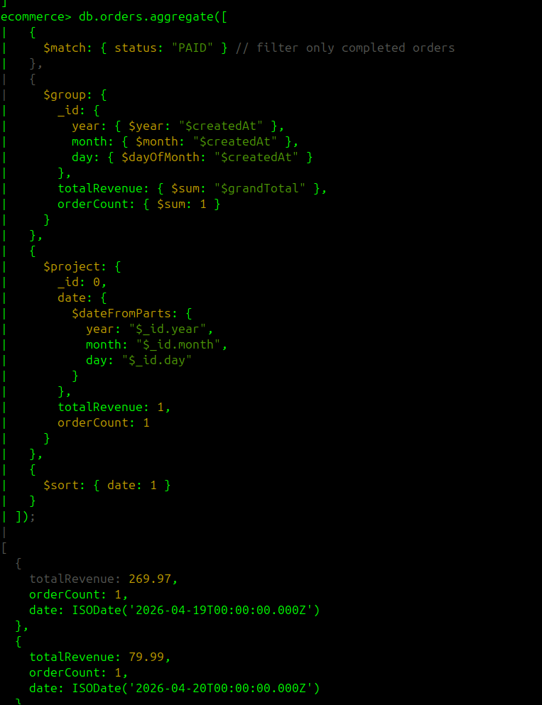

This is a pipeline that filters paid orders, groups them by date, and computes total revenue and order count per day.

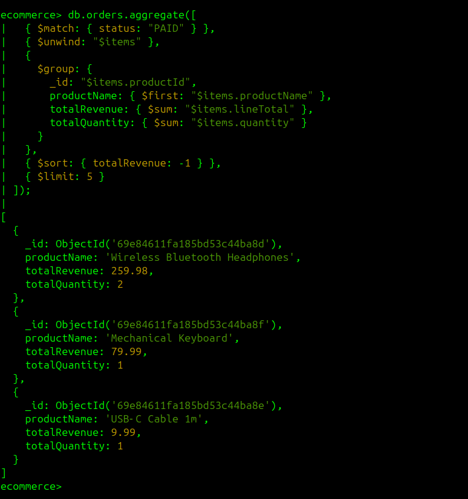

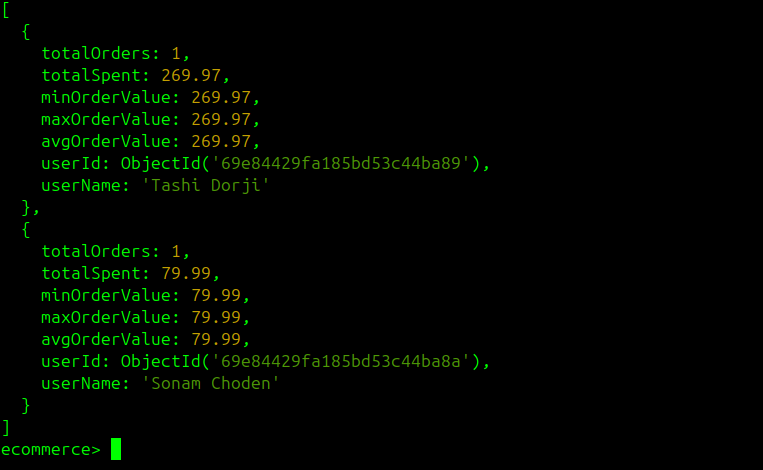

This is a pipeline that uses $unwind to flatten the items array and then groups by product to find the top 5 earners.

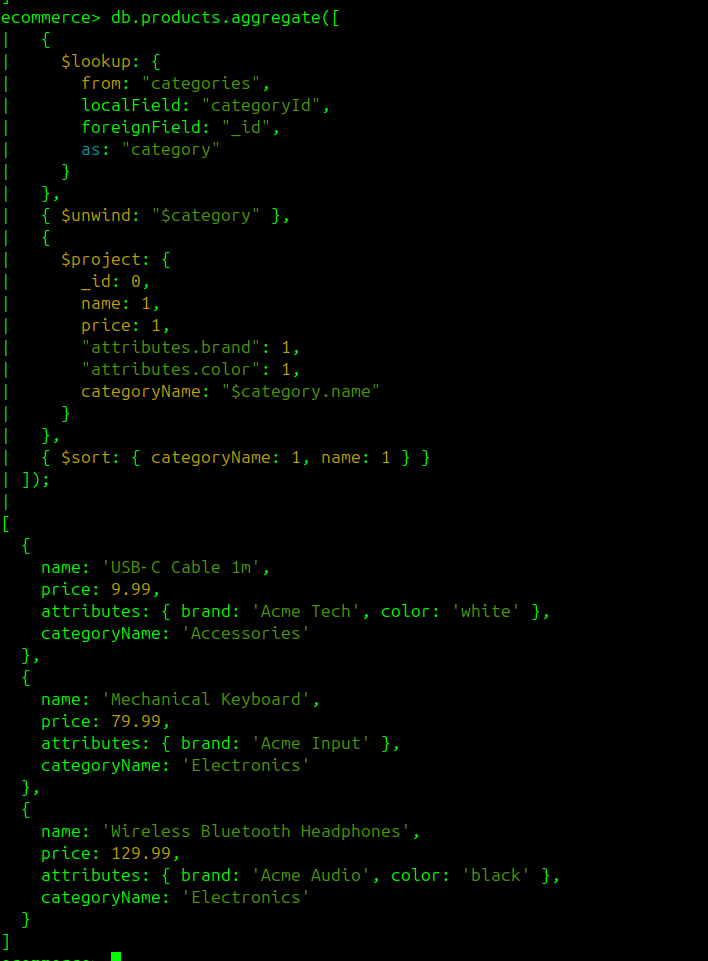

I use the same pipeline with the product that uses $unwind to flatten the items array and then groups by product to find the top 5 earners.

## Query Performance Optimization

Here two seperate queries was run to retrive orders for each users by using createdAt in descending order and sort({ createdAt: -1}) is used to return the newest first in the data query.

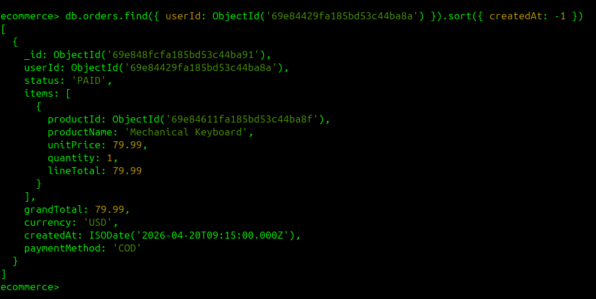

The updateMany method is used to where it finds all the order and update the order status from PAID to DELIVER. 

To confirm the updataMany method worked, Used the find() method and it shows both order shows DELIVER. All other fields are unchanged.

I have added 3 new documents(Wireless Ergonomic Mouse, Ultrabook Laptop 14, 27" 4K Monito) into the collection using insertMany() method.

I wanted to follow a suddent pipeline : 
- Captured (order management)
- Picked (Inventor yretrieval)
- Packed (Preparation)
- shippedn(Dispatch)
- Deleviered (Final receipt)
  
So i have made a logic in the database to follow the pipeline.

I used the find method to check if the pipeline is working or not without using the time range.

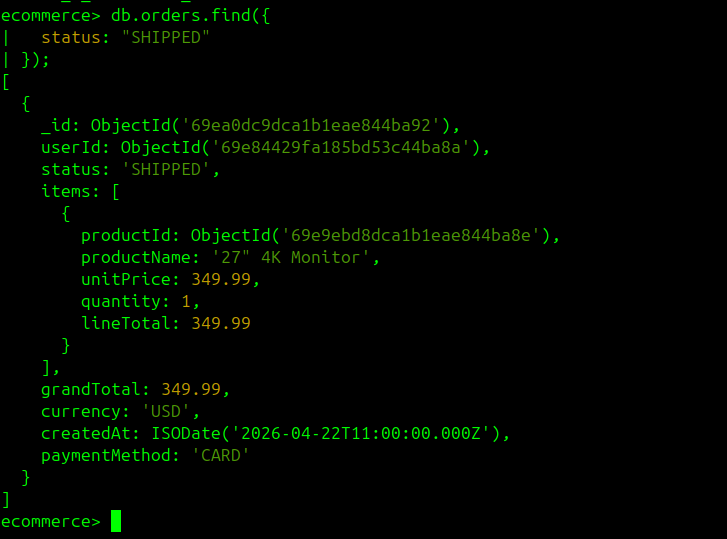

The main task is to filter order by status and time range. For that I used the $lte ( less than equal to) and $gte (greater than equal to)

to list the products by categoryID first we have to create the index first. The index is like a table of content that allows the system to locate belonging to specific category without scaning everysingle record in the table.

Listing the product in electronics category

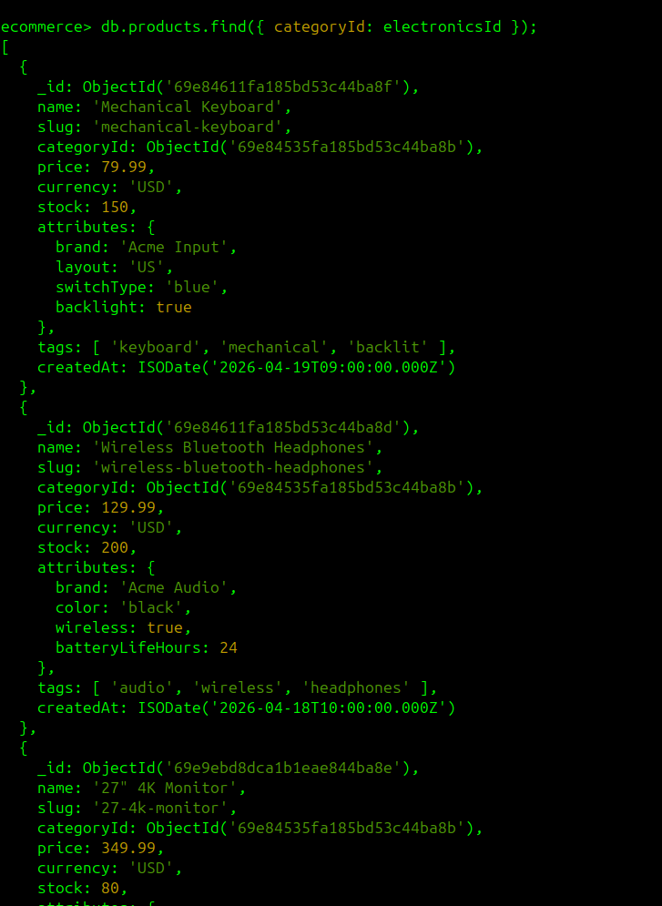

Sort by price highest first 

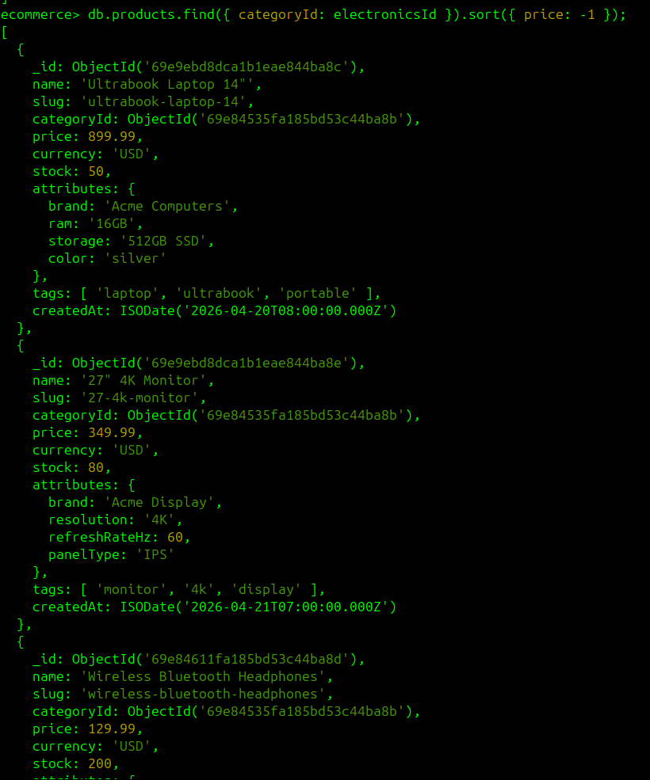

Sort by newest first (createdAt)

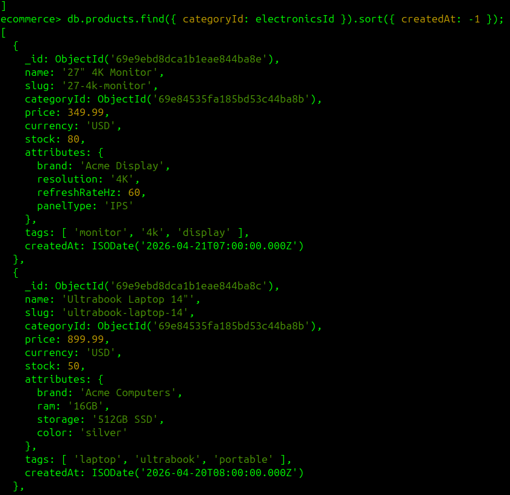

Listing the product in accoriess category

Sort by price — highest first

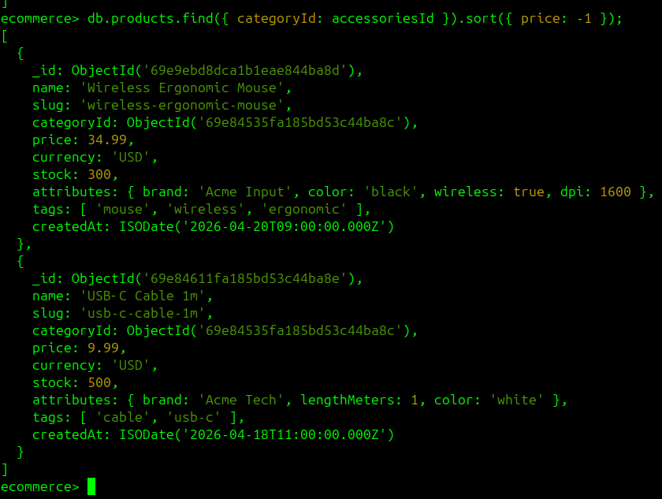

Sort by newest first (createdAt):

Search products by text (name, description, tags).

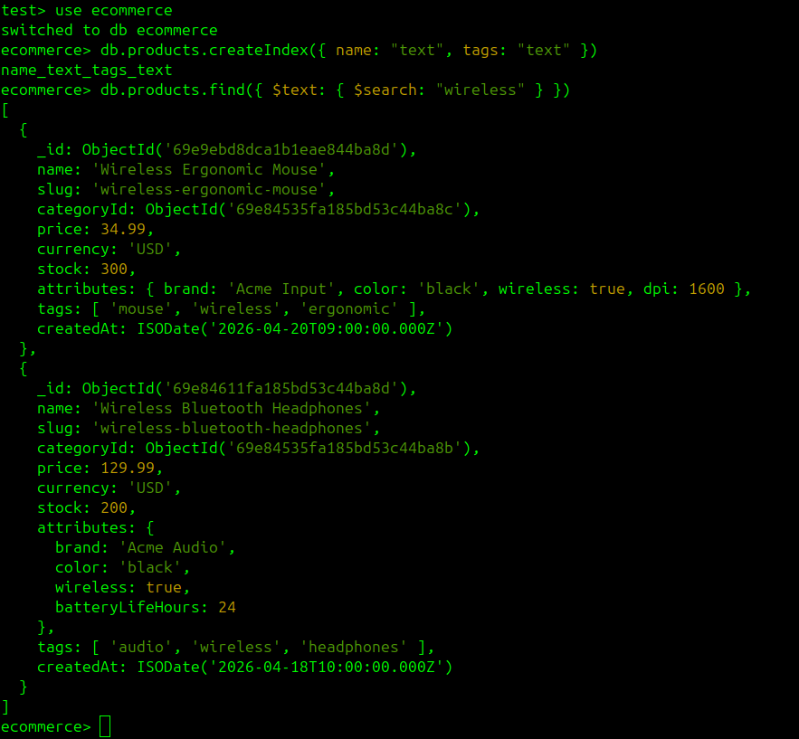

index for order and product

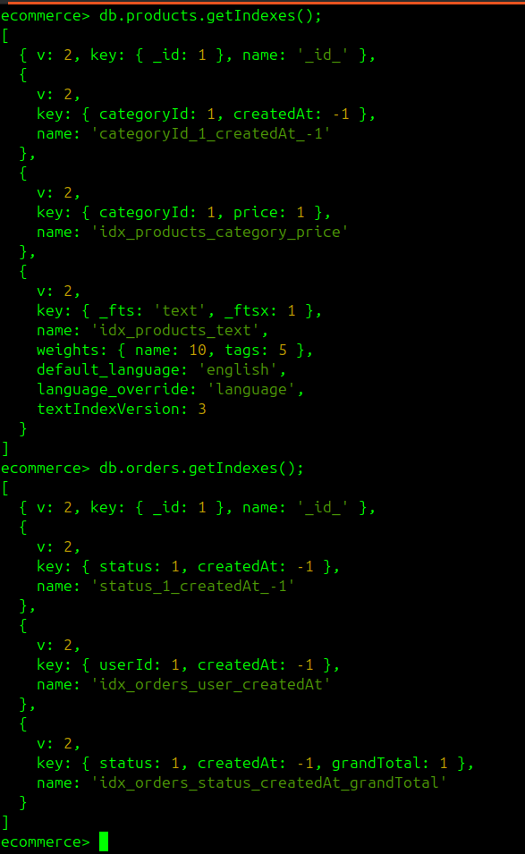

Using explain() to Analyze Query Plans

Example: Before and After Index

Run a Query Without an Index

Aggregation with Index‑Friendly 

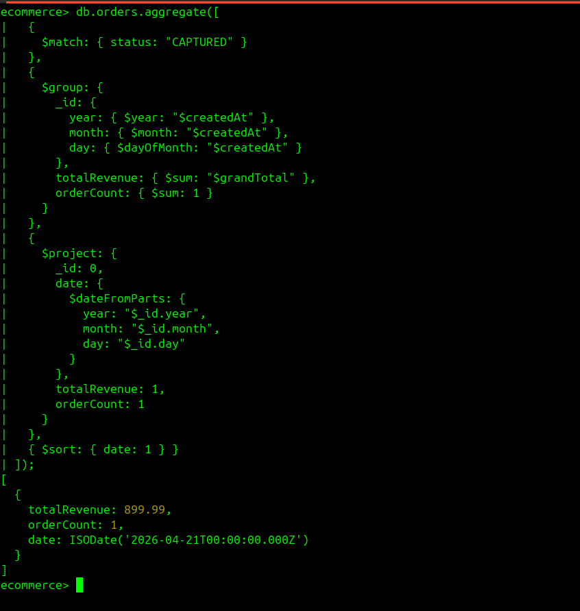

# Referrence

- [Reference 1](https://www.google.com/url?sa=t&source=web&rct=j&opi=89978449&url=https://www.mongodb.com/docs/manual/tutorial/model-tree-structures-with-parent-references/&ved=2ahUKEwj8892IlIyUAxW-RmwGHYBgHPwQFnoECBgQAQ&usg=AOvVaw3Nkk06LUuMscdM5R8exK67)
- [Reference 2](https://www.mongodb.com/docs/manual/reference/mql/query-predicates/comparison/)
- [Reference 3](https://www.mongodb.com/docs/manual/core/timeseries/timeseries-querying/)
- [Reference 4](https://www.mongodb.com/docs/manual/reference/method/db.collection.find/)