## Practical 6 : Securing Redis and MongoDB (Authentication, Encryption, RBAC, and Security Audit)

```
AIM

The aim of the practical is to verify authentication, encryption and role based access control for redis and mongoDB. It is also for the basic security audit of the configured database.
```
```
OBJECTIVE

1. Enable password-based authentication and Access Control Lists (ACL) in Redis.
2. Enable TLS encryption for Redis connections (at least at the configuration and client-connection level).
3. Enable authentication and RBAC in MongoDB using built-in user roles and custom roles.
4. Enable TLS for MongoDB so that all traffic is encrypted in transit.
5. Execute a simple security audit checklist (tests and commands) for both databases and record findings.
```
```
THEORY

1. Authentication in both redis and mongodb is the security layer that verifies the identity of a client before allowing them to access the database. However in mongodb the authentication is tied to role base access control where if the user prove who it is, mongodb checks what the user is allowed to do. But in redis it is for speed the authentication is simple than the mongdb. Redis uses the ACL ( Access control list), lagacy password and speed warning. 

2. Encryption in redis and mongodb is securing the data at different stages including data at transit and at the rest. However in mongodb the data is encrypted in the persistent layer and redis it stores the data in RAM for faster retrival the data is encrypted on the RAM. 

3. Role base access control in redis and mongodb refers to the security mechanism used to manage permissions based on user roles rather individual user accounts. However mongodb prodives a robust RBAC for the database that supports built in roles and customized roles. In redis the RBAC is supported by Access control List ( ACL ) which is implemented to define command level permissions.
```
Enabling ACL and created users in redis.conf

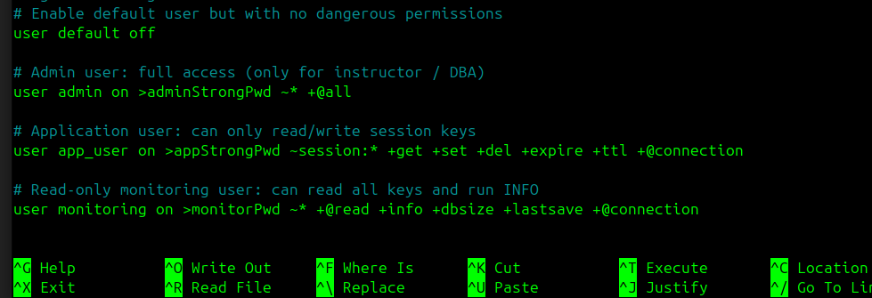

Testing as admin 
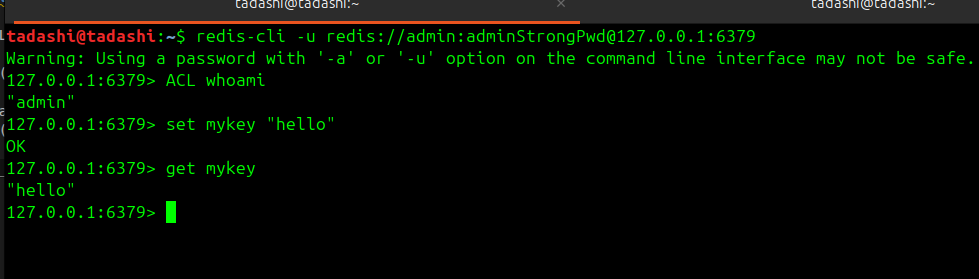

Test as app_user (RBAC check)

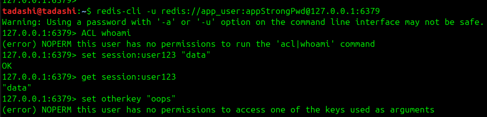

all the above demonstrates RBAC using ACL rules. 

Enabling TLS for Redis

1. Generate Self-Signed Certificates
- Created a CA ( Certificate Authority ) for this lap.
- Created a private key where only I can sign with it.

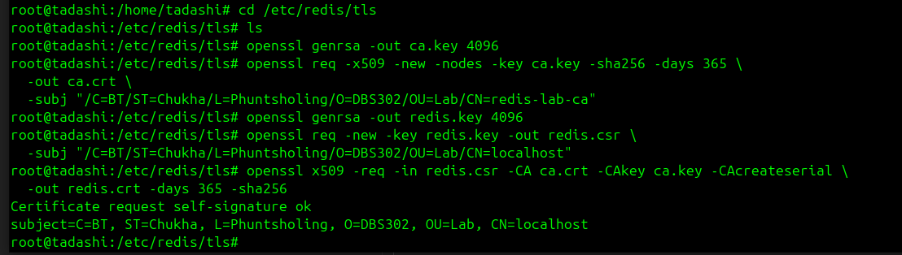

This creates ca.crt, redis.crt, redis.key in /etc/redis/tls.

2. Update redis.conf for TLSRBAC i


## Part B : Securing MongoDB 

- Start MongoDB Without Auth.  MongoDB without auth fails to load. 
  
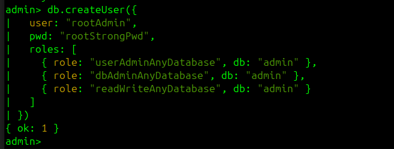

- Enable Authentication in mongod.conf which turns on  turns on access control (RBAC)
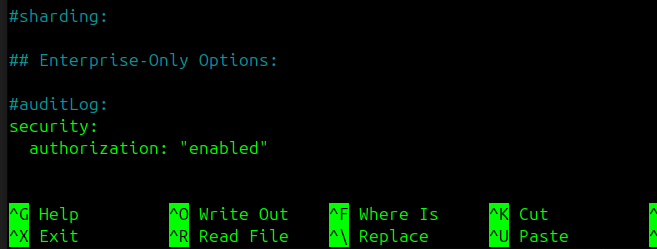

- Testing Authentication.
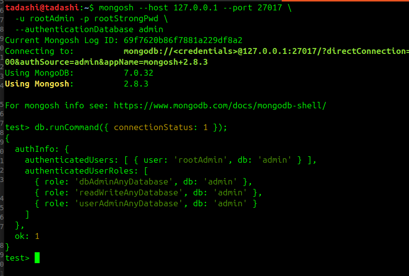

The output shows the authenticated user and roles, confirming that auth is working.

- When connecting without username and password the show dbs command is failing. 

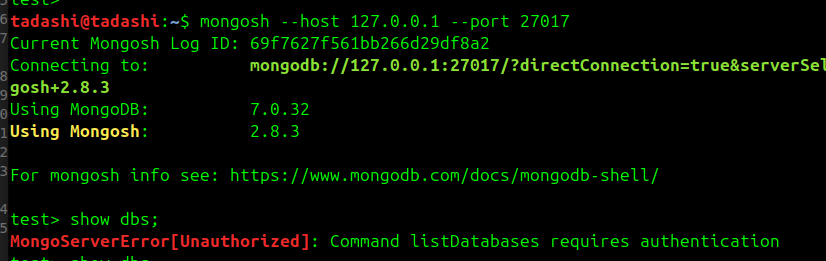

## Create Application Database, Role, and User (RBAC)

- creating an application specific database and limit permissions using roles. For this I logged in a mongosh, authenticated as rootAdmin. Created limited role for application users and created an application user with appuser. 
  
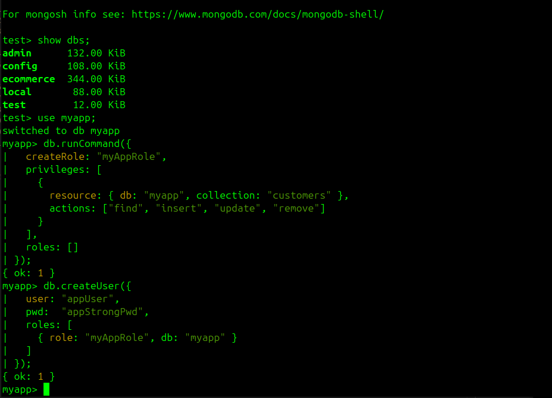

- Logged in as app user and inserted a data in myapp.
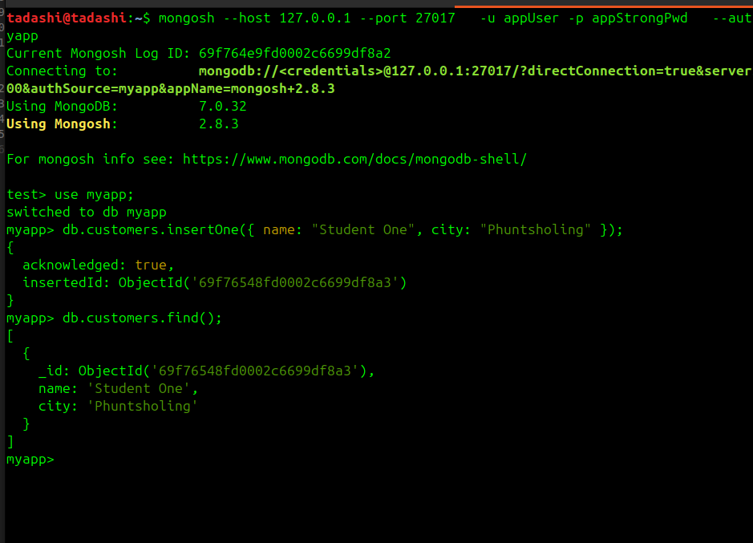

- Now when trying to find user logged in as app user it fails, since the app user does not have the permission on the admin database. This proves the RBAC where app user has limitted rights on the myapp.customers. 
  
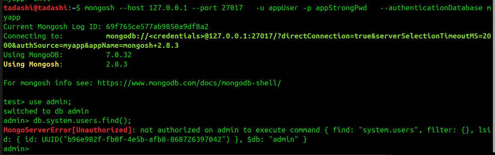

## Enable TLS Encryption for MongoDB

- TLS is used in data transit to enclrypt the data. 
- Generating a self-signed certificates for testing the TLS with MongoDB.
  
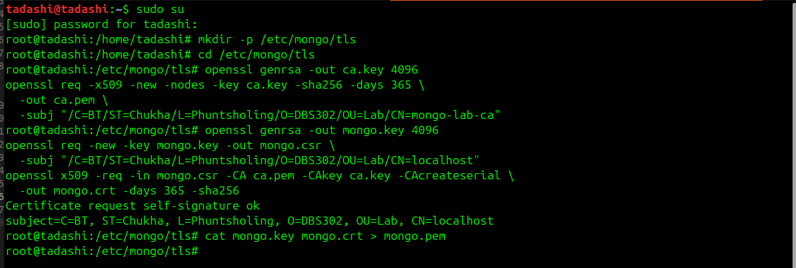

- Updating the mongod.conf for TLS and now all the connections in MongoDB must use the --tls flags.

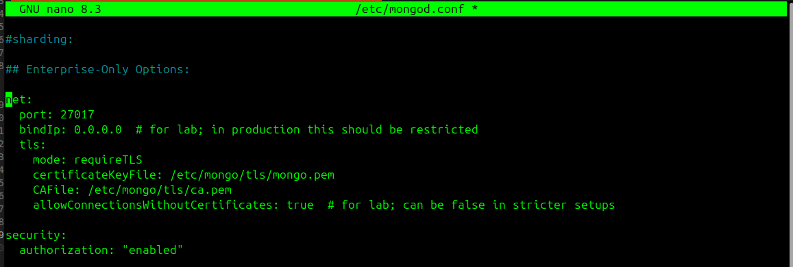

- Connecting with TLS and Auth, here the command fails without --tls and without correct credentials the authentication fails. This shows how encryption and RBAC are enforced.

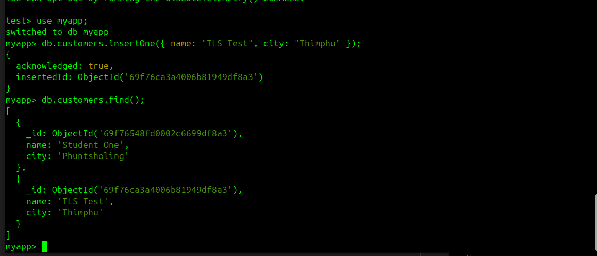

## Security Audit Findings

### Observations

- ACL tests: Redis commands with ACL users were checked and produced expected error messages when unauthorized actions were attempted.
- RBAC tests: MongoDB allowed operations for authorized roles and denied operations for users without the required permissions.
- TLS tests: secure connections succeeded with valid TLS configuration, while connection attempts failed without TLS or with incorrect certificates.

### Security Audit Summary

- What is secure now?
  - Redis authentication and ACL-based command restrictions are enabled.
  - MongoDB authentication and role-based access control are enforced.
  - TLS encryption is configured for both Redis and MongoDB to protect data in transit.

- What still needs improvement?
  - Password strength and rotation policies should be improved for both Redis and MongoDB users.
  - Network restrictions and firewall rules should be tightened to limit database access to trusted hosts only.

### Conclusion

The security features implemented here show how authentication, ACL/RBAC, and TLS work together to protect NoSQL databases. Proper access controls prevent unauthorized commands and data access. Encryption in transit ensures credentials and query traffic are not exposed over the network.

