# DBS302 – Practical 3

### Create Database and Collection

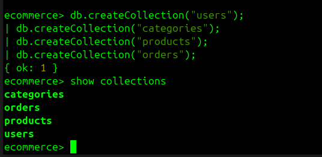

### Insert Sample Data

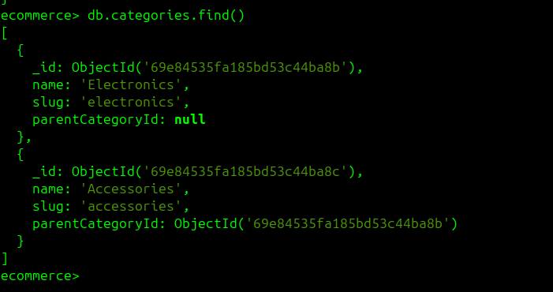

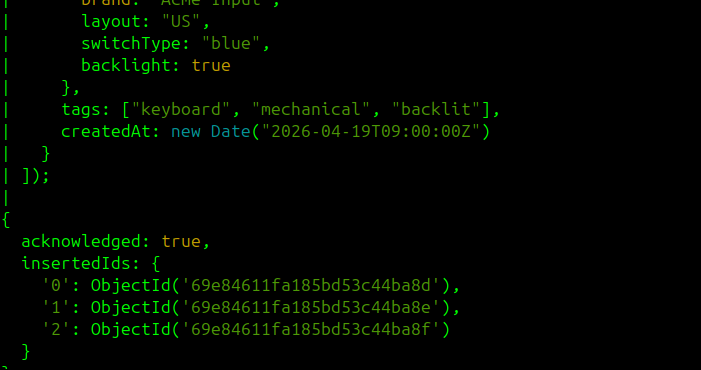

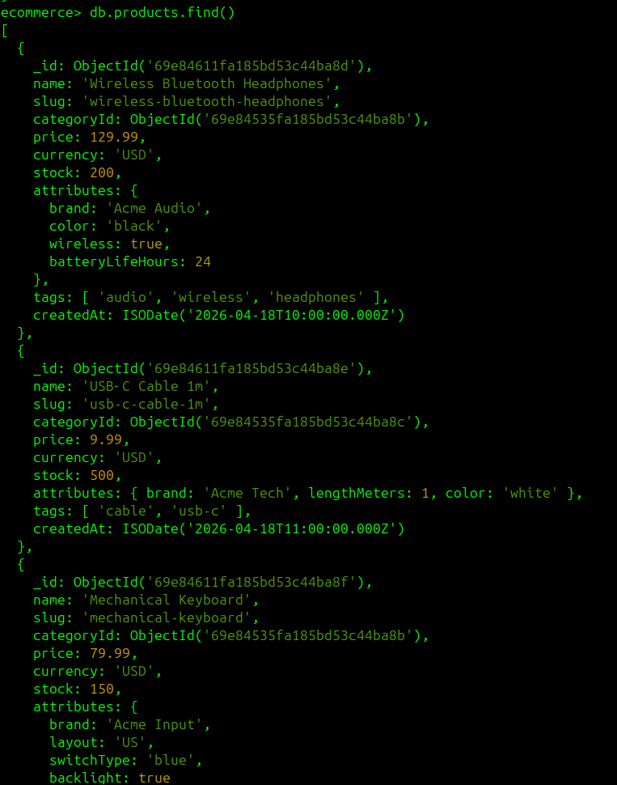

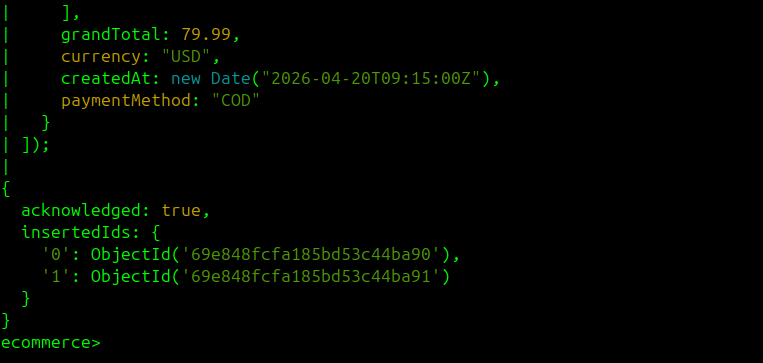

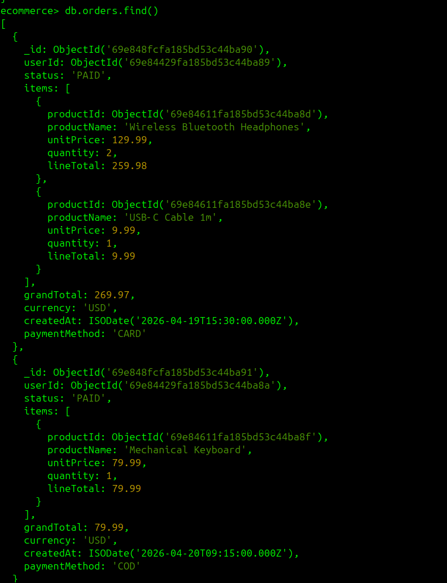

## Aggregation Framework: Core Analytics Queries

## Query Performance Optimization

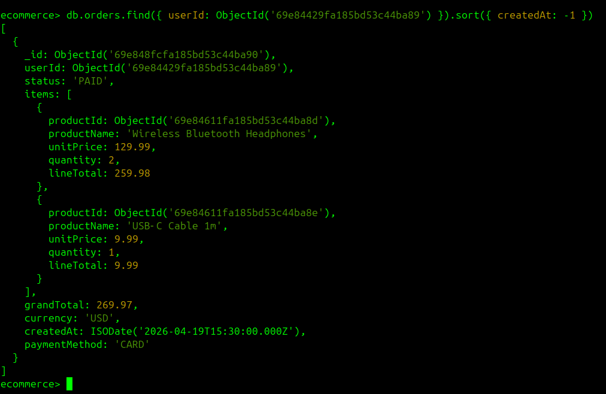

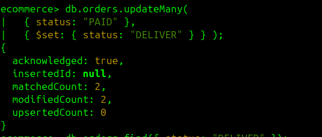

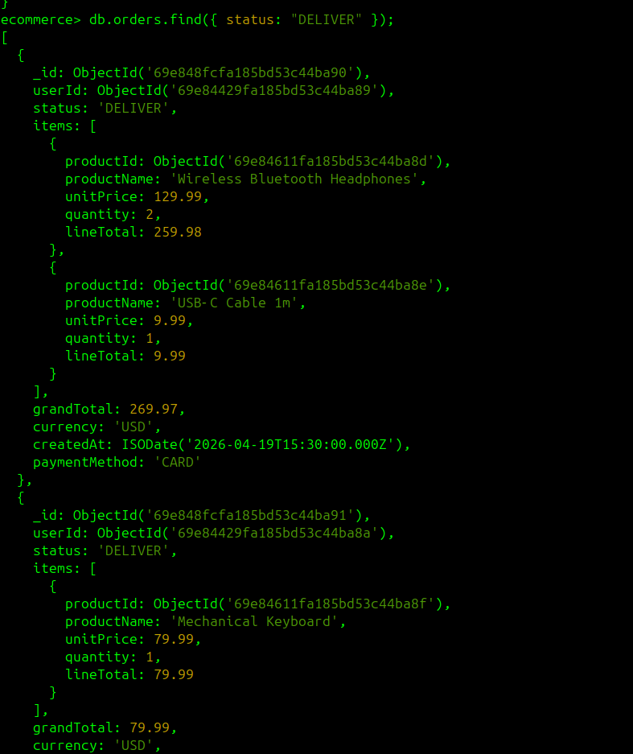

I wanted to follow a suddent pipeline : captured, picked, packed, shipped , deleviered. So i have made a logic in the database to follow the pipeline.

Filter by status + time range:

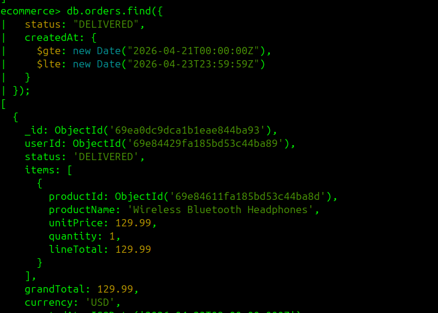

to list the products by categoryID first we have to create the index first. The index is like a table of content that allows the system to locate belonging to specific category without scaning everysingle record in the table.

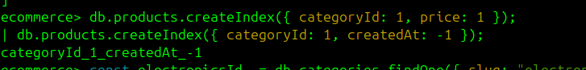

Listing the product in electronics category

Sort by price highest first 

Sort by newest first (createdAt)

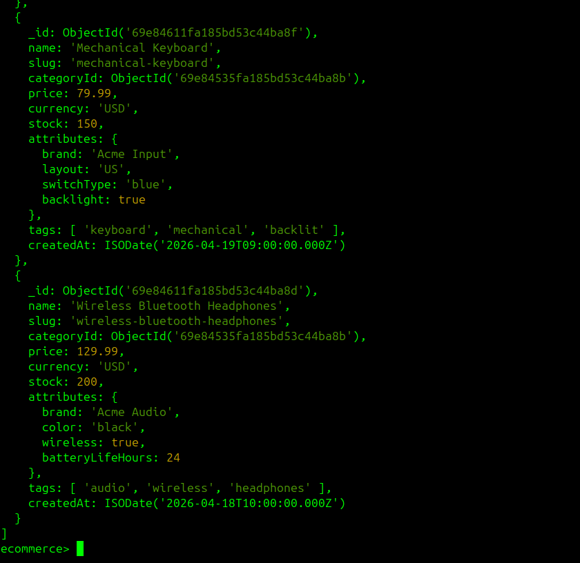

Listing the product in accoriess category

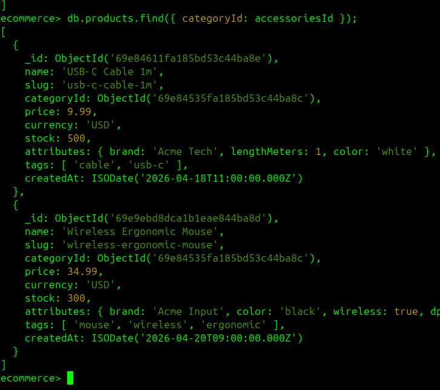

Sort by price — highest first

Sort by newest first (createdAt):

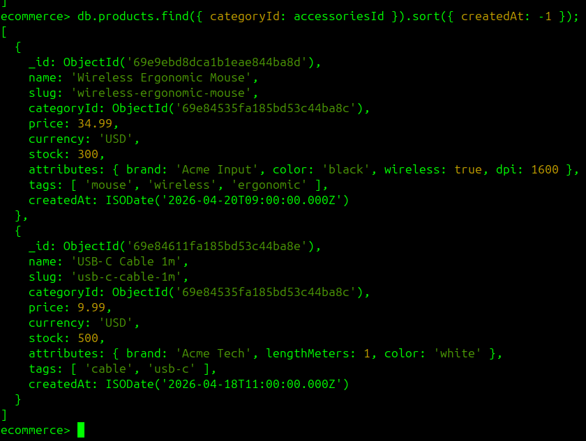
# DBS302_Practical
